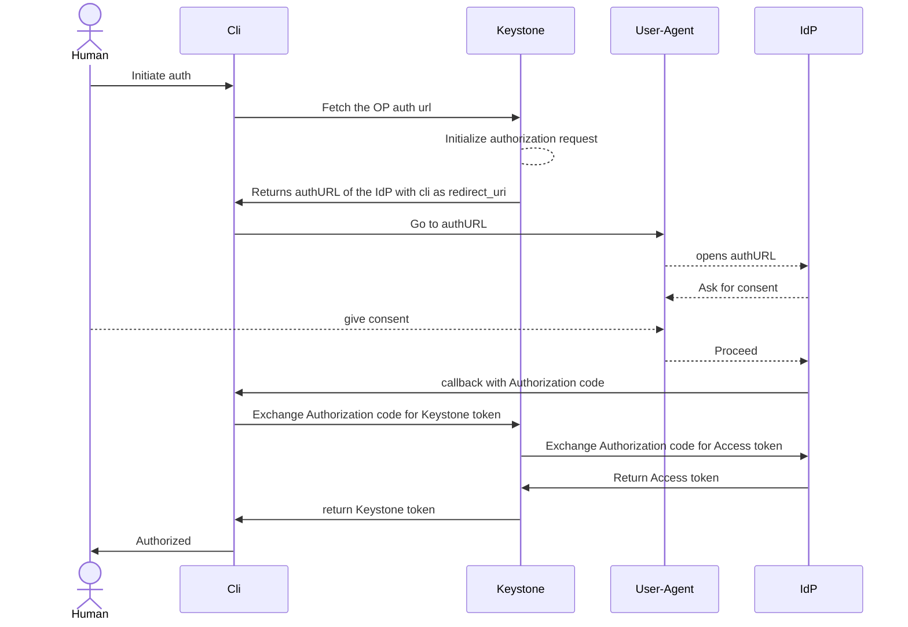

# Federation support

Python Keystone is not implementing the Federation natively (neither SAML2, nor
OIDC). It relies on the proxy server for the authentication protocol specifics
and tries to map resulting users into the local database. This leads to a
pretty big number of limitations (not limited to):

- Identity Provider can be only configured by cloud administrators only

- Pretty much any change on the IdP configuration require restart of the service

- Certain protocol specifics can not be implemented at all (i.e. backend
  initiated logout)

- Forces deployment of the proxy service in front of Keystone relying on the
  modules for SAML2 and/or OIDC implementation (such modules may be abandoned
  or removed).

- Client authentication right now is complex and error prone (every public
  provider has implementation specifics that are often even not cross-compatible)


In order to address those challenges and complete reimplementation is being
done here. This leads to a completely different design opening doors for new
features.

- Federation is controlled on the domain level by the domain managers. This
  means that the domain manager is responsible for the configuration of how users
  should be federated from external IdPs.

- Keystone serves as a relying party in the OIDC authentication flow. This
  moves the complex logic from client to the the Keystone side. This allows
  making client applications much simpler and more reliable.

## Authentication using the Authorization Code flow and Keystone serving as RP



## Authenticating with the JWT

This is a work in progress and is not implemented yet

## API changes

A series of brand new API endpoints have been added to the Keystone API.

- /v3/federation/identity_providers (manage the identity providers)

- /v3/federation/mappings (manage the mappings tied to the identity provider)

- /v3/federation/auth (initiate the authentication and get the IdP url)

- /v3/federation/oidc/callback (exchange the authorization code for the Keystone token)

## DB changes

Following tables are added:

- federated_identity_provider

```rust
{{#rustdoc_include ../../src/db/entity/federated_identity_provider.rs:9:21}}
```

- federated_mapping

```rust
{{#include ../../src/db/entity/federated_mapping.rs:9:24}}
```

- federated_auth_state

```rust
{{#include ../../src/db/entity/federated_auth_state.rs:8:16}}
```


## Compatibility notes

Since the federation is implemented very differently to how it was done before
it certain compatibility steps are implemented:

- Identity provider is "mirrored" into the existing identity_provider with the
  subset of attributes

- For every identity provider "oidc" protocol entry in the federation_protocol
  table is created pointing to the "<<null>>" mapping.

## Testing

Federation is very complex and need to be tested with every supported public
provider. Only this can guarantee that issues with not fully compliant OIDC
implementations can be identified early enough.

Authorization code flow requires presence of the browser. Due to that the tests
need to rely on Selenium.

At the moment following integrations are tested automatically:

- Keycloak (login using browser)
