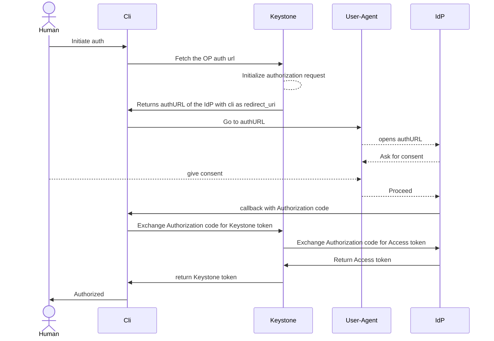

# Federation support

Python Keystone is not implementing the Federation natively (neither SAML2, nor
OIDC). It relies on the proxy server for the authentication protocol specifics
and tries to map resulting users into the local database. This leads to a
pretty big number of limitations (not limited to):

- Identity Provider can be only configured by cloud administrators only

- Pretty much any change on the IdP configuration require restart of the service

- Certain protocol specifics can not be implemented at all (i.e. backend
  initiated logout)

- Forces deployment of the proxy service in front of Keystone relying on the
  modules for SAML2 and/or OIDC implementation (such modules may be abandoned
  or removed).

- Client authentication right now is complex and error prone (every public
  provider has implementation specifics that are often even not cross-compatible)


In order to address those challenges and complete reimplementation is being
done here. This leads to a completely different design opening doors for new
features.

- Federation is controlled on the domain level by the domain managers. This
  means that the domain manager is responsible for the configuration of how users
  should be federated from external IdPs.

- Keystone serves as a relying party in the OIDC authentication flow. This
  moves the complex logic from client to the the Keystone side. This allows
  making client applications much simpler and more reliable.

## Authentication using the Authorization Code flow and Keystone serving as RP



## Authenticating with the JWT

It is possible to authenticate with the JWT token issued by the federated IdP.
More precisely it is possible to exchange a valid JWT for the Keystone token.
There are few different use scenarios that are covered.

Since the JWT was issued without any knowledge of the Keystone scopes it
becomes hard to control scope. In the case of real human login the Keystone may
issue unscoped token allowing user to further rescope it. In the case of the
workflow federation that introduces a potential security vulnerability. As such
in this scenario the attribute mapping is responsible to fix the scope.

Login request looks following:

```console

  curl https://keystone/v4/federation/identity_providers/${IDP}/jwt -X POST -H "Authorization: bearer ${JWT}" -H "openstack-mapping: ${MAPPING_NAME}"
```

### Regular user obtains JWT (ID token) at the IdP and presents it to Keystone

In this scenario a real user (human) is obtaining the valid JWT from the IDP
using any available method without any communication with Keystone. This may
use authorization code grant, password grant, device grant or any other enabled
method. This JWT is then presented to the Keystone and an explicitly requested
attribute mapping converts the JWT claims to the Keystone internal
representation after verifying the JWT signature, expiration and further
restricted bound claims.

### Workflow federation

Automated workflows (Zuul job, GitHub workflows, GitLab CI, etc) are typical
workloads not being bound to any specific user and are more regularly
considered being triggered by certain services. Such workflows are usually in
possession of a JWT token issued by the service owned IdP. Keystone allows
exchange of such tokens to the regular Keystone token after validating token
issuer signature, expiration and applying the configured attribute mapping.
Since in such case there is no real human the mapping also need to be
configured slightly different.

- It is strongly advised the attribute mapping must fill `token_user_id`,
  `token_project_id` (and soon `token_role_ids`). This allows strong control of
  which technical account (soon a concept of service accounts will be introduced
  in Keystone) is being used and which project such request can access.

- Attribute mapping should use `bound_audiences`, `bound_claims`,
  `bound_subject`, etc to control the tokens issued by which workflows are
  allowed to access OpenStack resources.

### GitHub workflow federation

In order for the GitHub workflow to be able to access OpenStack resources it is
necessary to register GitHub as a federated IdP and establish a corresponding
attribute mapping of the `jwt` type.

IdP:

```json
"identity_provider": {
    "name": "github",
    "bound_issuer": "https://token.actions.githubusercontent.com",
    "jwks_url": "https://token.actions.githubusercontent.com/.well-known/jwks"
}
```


Mapping:

```json
"mapping": {
   "type": "jwt",
   "name": "gtema_keystone_main",
   "idp_id": <IDP_ID>,
   "domain_id": <DOMAIN_ID>,
   "bound_audiences": ["https://github.com"],
   "bound_subject": "repo:gtema/keystone:pull_request",
   "bound_claims": {
       "base_ref": "main"
   },
   "user_id_claim": "actor_id",
   "user_name_claim": "actor",
   "token_user_id": <UID>
}
```

TODO: add more claims according to [docs](https://docs.github.com/en/actions/reference/security/oidc#oidc-token-claims)

A way for the workflow to obtain the JWT [is described here](https://docs.github.com/en/actions/reference/security/oidc#methods-for-requesting-the-oidc-token).

```yaml
...
permissions:
  token: write
  contents: read

job:
  ...
  - name: Get GitHub JWT token
    id: get_token
    run: |
      TOKEN_JSON=$(curl -H "Authorization: bearer $ACTIONS_ID_TOKEN_REQUEST_TOKEN" \
      "$ACTIONS_ID_TOKEN_REQUEST_URL&audience=https://github.com")

      TOKEN=$(echo $TOKEN_JSON | jq -r .value)
      echo "token=$TOKEN" >> $GITHUB_OUTPUT
  ...
  # TODO: build a proper command for capturing the actual token and/or write a dedicated action for that.
  - name: Exchange GitHub JWT for Keystone token
    run: |
      KEYSTONE_TOKEN=$(curl -H "Authorization: bearer ${{ steps.get_token.outputs.token }}" -H "openstack-mapping: gtmema_keystone_main" https://keystone_url/v4/federation/identity_providers/IDP/jwt)

```

## API changes

A series of brand new API endpoints have been added to the Keystone API.

- /v3/federation/identity_providers (manage the identity providers)

- /v3/federation/mappings (manage the mappings tied to the identity provider)

- /v3/federation/auth (initiate the authentication and get the IdP url)

- /v3/federation/oidc/callback (exchange the authorization code for the Keystone token)

- /v3/federation/identity_providers/{idp_id}/jwt (exchange the JWT token issued by the referred IdP for the Keystone token)

## DB changes

Following tables are added:

- federated_identity_provider

```rust
{{#rustdoc_include ../../src/db/entity/federated_identity_provider.rs:9:21}}
```

- federated_mapping

```rust
{{#include ../../src/db/entity/federated_mapping.rs:9:24}}
```

- federated_auth_state

```rust
{{#include ../../src/db/entity/federated_auth_state.rs:8:16}}
```


## Compatibility notes

Since the federation is implemented very differently to how it was done before
it certain compatibility steps are implemented:

- Identity provider is "mirrored" into the existing identity_provider with the
  subset of attributes

- For every identity provider "oidc" protocol entry in the federation_protocol
  table is created pointing to the "<<null>>" mapping.

## Testing

Federation is very complex and need to be tested with every supported public
provider. Only this can guarantee that issues with not fully compliant OIDC
implementations can be identified early enough.

Authorization code flow requires presence of the browser. Due to that the tests
need to rely on Selenium.

At the moment following integrations are tested automatically:

- Keycloak (login using browser)
