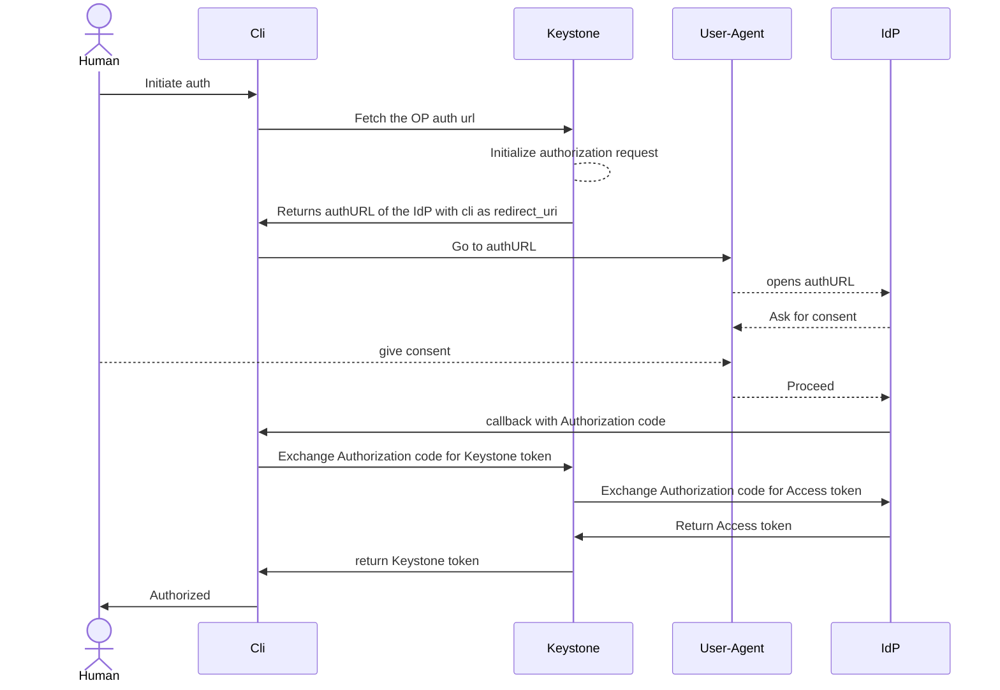

# Authentication using the Authorization Code flow and Keystone serving as RP

## TLDR

The user client (cli) sends authentication request to Keystone specifying the
identity provider, the preferred attribute mapping and optionally the scope (no
credentials in the request). In the response the user client receives the time
limited URL of the IDP that the user must open in the browser. When
authentication in the browser is completed the user is redirected to the
callback that the user also sent in the initial request (most likely on the
localhost). User client is catching this callback containing the OIDC
authorization code. Afterwards this code is being sent to the Keystone together
with the authentication state and the user receives regular scoped or unscoped
Keystone token.
